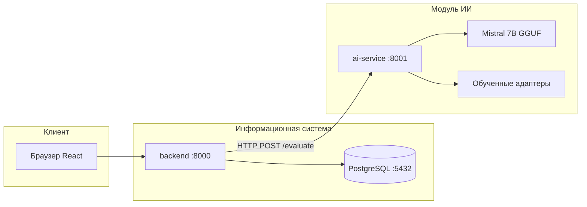
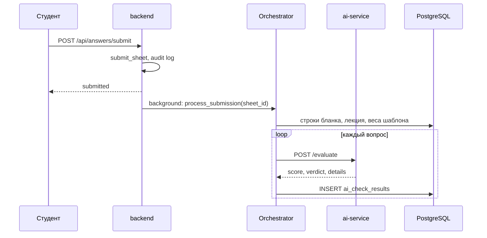

# Глава 3. Реализация интеллектуальной системы AutoAssess

Настоящая глава описывает практическую реализацию системы автоматизированной оценки письменных работ студентов, спроектированной в главе 2. Рассматриваются: выбор средств разработки, создание базы данных, серверная и клиентская части, модуль искусственного интеллекта с четырьмя адаптерами, обучение адаптеров на имеющихся корпусах и интеграция компонентов в единый программный комплекс.

---

## 3.1. Состав программного комплекса и среда разработки

### 3.1.1. Архитектура развёртывания

Система реализована как набор микросервисов, описанных в `docker-compose.yml`:



| Сервис | Каталог | Порт | Назначение |
|--------|---------|------|------------|
| `frontend` | `frontend/` | 3000 | SPA: преподаватель, администратор, студент |
| `backend` | `backend/` | 8000 | REST API, оркестрация, БД |
| `ai-service` | `ai-service/` | 8001 | Оценка ответов, адаптеры |
| `postgres` | — | 5432 | Хранение данных (продакшн) |

Для локальной разработки и E2E-тестов backend может работать с SQLite (`e2e.db`), без Docker.

### 3.1.2. Технологический стек

| Уровень | Технологии | Обоснование |
|---------|------------|-------------|
| Backend | Python 3.11, FastAPI, SQLAlchemy 2, Alembic | Асинхронный API, ORM, версионирование схемы БД |
| Аутентификация | JWT (python-jose), pbkdf2_sha256 (passlib) | Роли admin / teacher / временный студент |
| Frontend | React 18, TypeScript, Vite, react-hook-form, axios | Типизированный UI, быстрая сборка |
| Модуль ИИ | llama-cpp-python, GGUF Mistral 7B | Локальный инференс без облака |
| Обучение адаптеров | pandas, scikit-learn, joblib | CPU-обучение на корпусах из `dataset/` |
| Контейнеризация | Docker, Docker Compose | Изоляция и воспроизводимость окружения |

### 3.1.3. Структура репозитория

```
AutoAssess/
├── backend/           # Информационная система
├── ai-service/        # Модуль ИИ
├── frontend/          # Клиентская часть
├── training/          # Подготовка данных и обучение адаптеров
├── dataset/           # Исходные корпуса (GEC, LiDiRus, in_domain)
├── models/            # GGUF Mistral (не в git)
├── docs/              # Материалы диссертации
├── scripts/           # E2E и служебные скрипты
└── docker-compose.yml
```

---

## 3.2. Реализация базы данных

### 3.2.1. Миграции и версионирование схемы

Схема БД задаётся миграциями Alembic в `backend/migrations/versions/`.

**Миграция 001** создаёт основные сущности, соответствующие логической модели из §2.1.4:

- `users` — учётные записи (роли `admin`, `teacher`);
- `study_groups` — шифры групп;
- `lecture_materials` — загруженные лекции;
- `assessment_templates` — оценочные шаблоны;
- `questions` — вопросы с эталонным ответом;
- `sessions` — сессии проверки с кодом подключения;
- `answer_sheets` + `student_answers` — бланки и тексты ответов;
- `ai_check_results` — результаты автоматической проверки.

Фрагмент миграции для результата ИИ:

```python
# backend/migrations/versions/001_initial.py
op.create_table(
    "ai_check_results",
    sa.Column("check_id", sa.Integer(), primary_key=True, autoincrement=True),
    sa.Column("sheet_id", sa.Integer(), nullable=False),
    sa.Column("question_id", sa.Integer(), nullable=False),
    sa.Column("score", sa.Float(), nullable=False),
    sa.Column("confidence", sa.Float(), nullable=False),
    sa.Column("verdict", sa.Enum("passed", "failed", "review", name="verdict")),
    sa.Column("explanation", sa.Text(), nullable=False),
    sa.Column("weaknesses", sa.JSON(), nullable=True),
    sa.Column("strengths", sa.JSON(), nullable=True),
    ...
)
```

**Миграция 002** добавляет поля из главы 2 диссертации:

- веса адаптеров в `assessment_templates` (`weight_relevance`, `weight_correctness`, …);
- ФИО и `device_fingerprint` в `answer_sheets`;
- `details` (JSON) и `model_version` в `ai_check_results`;
- таблицы `system_logs`, `system_settings`.

```python
# backend/migrations/versions/002_dissertation_fields.py
op.add_column("assessment_templates", sa.Column("weight_relevance", sa.Float(), server_default="0.25"))
op.add_column("ai_check_results", sa.Column("details", sa.JSON(), nullable=True))
op.create_table("system_settings", ...)
```

### 3.2.2. ORM-модели

Доменные сущности описаны в `backend/app/models.py` (SQLAlchemy 2, декларативный стиль). Связи:

- шаблон → вопросы (1:N);
- шаблон → лекция (N:1 через `material_id`);
- сессия → шаблон, группы, бланки;
- бланк → ответ студента, результат ИИ.

При старте на SQLite выполняется `Base.metadata.create_all` и создаётся учётная запись администратора (`admin@example.com` / `admin123`) — см. `backend/app/main.py`.

### 3.2.3. Настройки системы

Пороги проверки хранятся в `system_settings` и читаются оркестратором:

| Ключ | Значение по умолчанию | Назначение |
|------|----------------------|------------|
| `passing_threshold` | 0.6 | Нормированный порог зачёта |
| `confidence_threshold` | 0.7 | Порог уверенности для вердикта `review` |
| `ai_timeout_sec` | 60 | Таймаут HTTP-запроса к модулю ИИ |

---

## 3.3. Реализация серверной части (backend)

### 3.3.1. Точка входа и маршрутизация

Приложение FastAPI инициализируется в `backend/app/main.py`. Подключаются роутеры:

| Префикс | Файл | Функции |
|---------|------|---------|
| `/api/auth` | `routers/auth.py` | Вход, обновление JWT |
| `/api/users`, `/api/groups` | `users.py`, `groups.py` | Администрирование |
| `/api/templates` | `templates.py` | Шаблоны, вопросы, лекции |
| `/api/sessions` | `sessions.py` | Сессии, подключение студента |
| `/api/answers` | `answers.py` | Сохранение и отправка ответов |
| `/api/sessions/.../results` | `results.py` | Результаты, утверждение, экспорт |
| `/api/admin` | `admin.py` | Логи, настройки |
| `/api/student` | `student.py` | Просмотр результатов студентом |

CORS настраивается из переменной `CORS_ORIGINS` для взаимодействия с frontend на порту 3000.

### 3.3.2. Аутентификация и роли

Реализация JWT в `backend/app/auth.py`:

```python
def create_access_token(subject: str, role: str) -> str:
    expire = datetime.now(timezone.utc) + timedelta(minutes=settings.access_token_expire_minutes)
    return jwt.encode(
        {"sub": subject, "type": "access", "role": role, "exp": expire},
        settings.secret_key,
        algorithm=settings.algorithm,
    )
```

Зависимость `require_roles(UserRole.teacher, UserRole.admin)` ограничивает доступ к API преподавателя. Студент **не регистрируется**: подключается по коду сессии (`POST /api/sessions/join`) без постоянного аккаунта.

Пароли хэшируются через `pbkdf2_sha256` (совместимость с portable Python без native bcrypt).

### 3.3.3. Работа с шаблонами и лекциями

**Создание шаблона** — `POST /api/templates` с полями имени и весов адаптеров.

**Добавление вопроса** — `POST /api/templates/{id}/questions`:

```json
{
  "text": "Что такое ООП?",
  "correct_answer": "Объектно-ориентированное программирование...",
  "max_score": 10
}
```

**Загрузка лекции** — `POST /api/templates/{id}/lecture` (PDF или DOCX). Последовательность в `backend/app/routers/templates.py`:

1. Сохранение файла в `uploads/lectures/`;
2. Запись в `lecture_materials`, привязка к шаблону;
3. Извлечение текста (`lecture_text.py`) и тем (`lecture_topics.py`);
4. Сохранение профиля релевантности: `ai-service/models/adapters/relevance/template_{id}.json`.

```python
# backend/app/services/lecture_topics.py
def process_lecture_for_template(template_id: int, file_path: str) -> dict:
    text = load_lecture_text(file_path)
    topics = extract_topics(text) if text else []
    payload = {"template_id": template_id, "topics": topics, ...}
    out = RELEVANCE_DIR / f"template_{template_id}.json"
    out.write_text(json.dumps(payload, ensure_ascii=False, indent=2), encoding="utf-8")
    return payload
```

Так реализовано **обучение адаптера релевантности на лекции** без отдельного размеченного датасета (§2.2.4.2).

### 3.3.4. Сессии и подключение студента

**Создание сессии** — `POST /api/sessions`: имя, `template_id`, список групп, время начала/окончания. Генерируется уникальный `connection_code`.

**Подключение студента** — `POST /api/sessions/join`:

```python
# backend/app/routers/sessions.py (фрагмент)
session_id, sheet_id = crud.join_session(
    db, session, body.student_name, body.group_cipher,
    body.last_name, body.first_name, body.patronymic, body.device_fingerprint,
)
return SessionJoinResponse(session_id=session_id, sheet_id=sheet_id, ...)
```

В `crud.join_session` создаются строки `answer_sheets` по всем вопросам шаблона для данного `sheet_id`.

### 3.3.5. Сохранение и отправка ответов

| Действие | Endpoint | Что происходит |
|----------|----------|----------------|
| Сохранить черновик | `POST /api/answers/save` | Upsert в `student_answers` |
| Отправить на проверку | `POST /api/answers/submit` | `submitted_at`, фоновая задача ИИ |

Ключевой фрагмент отправки (`backend/app/routers/answers.py`):

```python
@router.post("/submit")
def submit_answers(body: AnswerSubmitRequest, background_tasks: BackgroundTasks, ...):
    if not all(r.answer_id for r in rows):
        raise HTTPException(status_code=400, detail="Not all questions answered")
    crud.submit_sheet(db, body.sheet_id)
    background_tasks.add_task(_run_orchestrator, body.sheet_id, timeout)
    return {"status": "submitted", "sheet_id": body.sheet_id}
```

Проверка выполняется **асинхронно** (FastAPI `BackgroundTasks`), чтобы студент не ждал ответа Mistral в HTTP-запросе.

### 3.3.6. Оркестратор проверки

Класс `Orchestrator` (`backend/app/services/orchestrator.py`) связывает ИС и модуль ИИ:



Формирование запроса к ИИ:

```python
request = EvaluateRequest(
    request_id=str(uuid.uuid4()),
    question=row.question.text,
    reference_answer=row.question.correct_answer,
    student_answer=row.student_answer.answer_text,
    max_score=row.question.max_score,
    context_materials=[lecture_text],  # текст лекции, не путь
    template_id=tpl.id if tpl else None,
    config=EvaluationConfig(passing_threshold=..., weights=weights),
)
ai_response = await self.ai_client.evaluate(request)
```

Клиент HTTP — `AIClient` в `backend/app/services/ai_client.py`; при недоступности ai-service возвращается вердикт `review` с пояснением.

### 3.3.7. Результаты и утверждение преподавателем

`backend/app/routers/results.py` предоставляет:

- список результатов по сессии;
- детализацию по `sheet_id` (ответ, балл, `details` по адаптерам);
- утверждение / корректировку балла (`approved_at`, `corrected_score`);
- экспорт CSV.

Аудит действий пишется через `backend/app/services/audit.py` в `system_logs`.

---

## 3.4. Реализация клиентской части (frontend)

### 3.4.1. Маршрутизация и роли

Маршруты заданы в `frontend/src/App.tsx`:

| URL | Компонент | Пользователь |
|-----|-----------|--------------|
| `/login` | `LoginPage` | Преподаватель, админ |
| `/teacher` | `TeacherPanel` | Преподаватель |
| `/admin` | `AdminPanel` | Администратор |
| `/templates/:id` | `TemplateEditor` | Редактор шаблона, лекция, веса |
| `/sessions/new` | `SessionForm` | Создание сессии |
| `/sessions/:id/results` | `ResultsTable` | Ведомость |
| `/results/:sheetId` | `ResultDetail` | Детали + утверждение |
| `/join` | `SessionJoin` | Студент (без логина) |
| `/answer/:sessionId` | `AnswerForm` | Ввод ответов |
| `/student/results/:sheetId` | `StudentResults` | Результаты для студента |

Компонент `PrivateRoute` проверяет JWT в `localStorage` и роль (`admin` / `teacher`).

### 3.4.2. HTTP-клиент

`frontend/src/api/client.ts` — axios с перехватчиком:

- подстановка `Authorization: Bearer <access_token>`;
- автоматическое обновление токена через `POST /api/auth/refresh` при 401.

Базовый URL задаётся при сборке: `VITE_API_URL` (в Docker — `http://localhost:8000`).

### 3.4.3. Сценарий студента

1. **SessionJoin** — код сессии, ФИО, опционально группа; вызывается `getDeviceFingerprint()` (`utils/fingerprint.ts`) для привязки бланка к устройству.
2. **AnswerForm** — список вопросов с `GET /api/sessions/{id}/questions`; сохранение через `answersApi.save`, отправка через `answersApi.submit`.
3. **StudentResults** — просмотр итогов после проверки (`/api/student/results/{sheet_id}`).

Пример подключения:

```typescript
// frontend/src/pages/SessionJoin.tsx
const { data: join } = await sessionsApi.join({
  connection_code: data.connection_code,
  last_name: data.last_name,
  first_name: data.first_name,
  patronymic: data.patronymic || null,
  device_fingerprint: getDeviceFingerprint(),
});
localStorage.setItem("sheet_id", String(join.sheet_id));
navigate(`/answer/${join.session_id}`);
```

### 3.4.4. Сценарий преподавателя

- **TeacherPanel** — список шаблонов и сессий.
- **TemplateEditor** — CRUD вопросов, загрузка лекции (multipart), настройка весов ω_rel, ω_corr, ω_norm, ω_logic.
- **ResultsTable** / **ResultDetail** — просмотр `details` JSON (оценки по каждому адаптеру), утверждение.

---

## 3.5. Реализация модуля искусственного интеллекта (ai-service)

### 3.5.1. API модуля ИИ

| Метод | Путь | Назначение |
|-------|------|------------|
| POST | `/evaluate` | Оценка одного ответа |
| GET | `/health` | Статус, загрузка GGUF и обученных голов |

Тело запроса (`ai-service/app/models.py`):

```python
class EvaluateRequest(BaseModel):
    request_id: str
    question: str
    reference_answer: str
    student_answer: str
    max_score: float = 10.0
    context_materials: Optional[List[str]] = None
    template_id: Optional[int] = None
    config: Optional[EvaluationConfig] = None
```

### 3.5.2. Загрузка базовой модели Mistral

`ai-service/app/llm/loader.py` загружает GGUF через `llama-cpp-python`:

```python
def load_model():
    model_path = Path(settings.model_path)
    if not model_path.exists():
        logger.warning("GGUF model not found — using heuristic evaluation")
        return None
    from llama_cpp import Llama
    _llm = Llama(model_path=str(model_path), n_ctx=settings.n_ctx, n_gpu_layers=settings.n_gpu_layers)
    return _llm
```

Если файл `models/mistral-7b-instruct-v0.1.Q4_K_S.gguf` отсутствует, модуль работает в режиме эвристики и обученных sklearn-голов.

### 3.5.3. Конвейер оценки четырьмя адаптерами

Точка входа — `ai-service/app/routers/evaluate.py`:

```python
rel = relevance_adapter.evaluate(question=..., student_answer=..., lecture_material=..., template_id=...)
cor = correctness_adapter.predict(input_text, temperature)  # [CLS] Q [SEP] E [SEP] S
norm = normativity_adapter.evaluate(request.student_answer, temperature)
log = logic_adapter.evaluate(request.student_answer, temperature)

total_normalized = (
    rel.score * weights["relevance"]
    + cor.score * weights["correctness"]
    + norm.score * weights["normativity"]
    + log.score * weights["logic"]
)
```

**Вердикт:**

- `confidence < confidence_threshold` → `review`;
- иначе `passed` / `failed` по `passing_threshold`.

**Итоговый балл:** `score = total_normalized * max_score`.

Результат включает `details` — JSON с полями каждого адаптера (scores, errors, topic_mismatches, architecture).

### 3.5.4. Адаптер релевантности (Pfeiffer)

Реализация: `ai-service/app/llm/relevance_engine.py`, `adapters/relevance.py`.

| Этап | Где | Что происходит |
|------|-----|----------------|
| Загрузка лекции | backend `lecture_topics.py` | Тематический вектор T → JSON |
| Инференс | `relevance_engine.py` | R = f(Q, S, L), учёт T по `template_id` |
| Fallback | эвристика / Mistral | Промпт LLM-as-Judge или пересечение тем |

При наличии `template_{id}.json` темы подставляются в оценку даже без повторного разбора PDF.

### 3.5.5. Адаптер корректности (Houlsby)

`adapters/correctness.py` — сравнение ответа с эталоном через `score_dimension(..., "correctness")` в `llm/inference.py`.

Режимы: Mistral (JSON с score) → эвристика (пересечение слов с эталоном). **Отдельное LoRA-дообучение не выполнялось** — нет датасета пар (эталон, ответ, экспертная оценка).

### 3.5.6. Адаптер нормативности (Parallel)

После обучения (`training/train_normativity.py`) загружается `normativity.joblib`:

```python
# ai-service/app/ml/trained_models.py
def predict_normativity(text: str) -> Tuple[float, float, List[dict]]:
    sentences = split_sentences(text) or [text]
    for sent in sentences:
        proba = float(model.predict_proba([sent])[0][1])
        ...
    score = sum(probs) / len(probs)
```

Слабые предложения попадают в `errors[]` в `details.normativity`.

### 3.5.7. Адаптер логики (Houlsby)

Аналогично — `logic.joblib`, проверка **соседних предложений** в ответе студента на признаки логической несогласованности (обучение на LiDiRus).

### 3.5.8. Соответствие проекту (глава 2) и реализации (глава 3)

| По диссертации (гл. 2) | Реализация (гл. 3) |
|------------------------|-------------------|
| LoRA Pfeiffer в слоях 9–12 | Тематический профиль + LLM/эвристика; LoRA — этап на GPU |
| LoRA Houlsby корректность | LLM-as-Judge + эвристика |
| Parallel нормативность | sklearn TF-IDF + LogReg (F1 ≈ 0,82) |
| Houlsby логика | sklearn на парах LiDiRus (F1 ≈ 0,61) |
| Обучение релевантности на лекции | `process_lecture_for_template` при upload |

---

## 3.6. Обучение адаптеров на корпусах `dataset/`

### 3.6.1. Подготовка данных

Скрипт `training/prepare_datasets.py`:

| Исходный файл | Записей | Выход |
|---------------|---------|-------|
| `russian_gec_dataset_final (1).csv` | ~25 000 | `processed/normativity.jsonl` |
| `LORuGEC.xlsx` | ~960 | (в том же JSONL) |
| `in_domain_train.csv` | ~7 869 | (в том же JSONL) |
| `LiDiRus.jsonl` | 1 104 | `processed/logic.jsonl` |

Итого для нормативности: **59 785** размеченных предложений.

### 3.6.2. Обучение

Запуск: `training/run_training.ps1` или по шагам:

```powershell
python training/prepare_datasets.py
python training/train_normativity.py
python training/train_logic.py
```

**Нормативность:** TF-IDF (1–2-граммы, max 50 000 признаков) + `LogisticRegression(class_weight='balanced')`.

**Метрики (тест 15 %):**

| Адаптер | Accuracy | F1 |
|---------|----------|-----|
| Нормативность | 0,802 | 0,822 |
| Логика | 0,542 | 0,608 |

Артефакты:

- `ai-service/models/adapters/normativity.joblib`
- `ai-service/models/adapters/logic.joblib`
- `training/reports/*.json` — метрики для диссертации

### 3.6.3. Релевантность

Отдельный файл в `dataset/` **не используется**. Адаптация — при загрузке лекции к шаблону (см. §3.3.3).

---

## 3.7. Интеграция и развёртывание

### 3.7.1. Docker Compose

При `docker-compose up --build`:

1. PostgreSQL поднимается с healthcheck;
2. `ai-service` монтирует `./models` с GGUF;
3. `backend` выполняет `alembic upgrade head`, `seed.py`, запускает uvicorn;
4. `frontend` собирается с `VITE_API_URL=http://localhost:8000`.

### 3.7.2. Локальная разработка без Docker

```powershell
# Backend (SQLite)
cd backend
pip install -r requirements.txt
alembic upgrade head
uvicorn app.main:app --reload

# AI-service
cd ai-service
pip install -r requirements.txt
$env:MODEL_PATH = "..\models\mistral-7b-instruct-v0.1.Q4_K_S.gguf"
python run_server.py

# Frontend
cd frontend
npm install
npm run dev

# Обучение адаптеров
.\training\run_training.ps1
```

### 3.7.3. E2E-проверка

`scripts/setup_and_run_e2e.ps1` — portable Python, SQLite, эвристический ai-service; `scripts/e2e_test.mjs` проходит сценарий: login → шаблон → сессия → студент → submit → ожидание `ai_check_results`.

---

## 3.8. Пример структуры `details` в БД

После проверки в `ai_check_results.details` сохраняется агрегированный отчёт:

```json
{
  "relevance": {
    "score": 46.0,
    "topic_mismatches": ["В ответе не раскрыт термин «наследование»"],
    "covered_topics": ["классы", "объекты"],
    "architecture": "pfeiffer"
  },
  "correctness": { "score": 50.0, "architecture": "houlsby" },
  "normativity": { "score": 55.0, "errors": [], "error_count": 0 },
  "logic": { "score": 46.8, "logic_errors": [], "coherence_ratio": 0.47 },
  "weights": { "relevance": 0.25, "correctness": 0.35, "normativity": 0.2, "logic": 0.2 }
}
```

Преподаватель видит эти данные на экране `ResultDetail`; студент — упрощённую версию на `StudentResults`.

---

## 3.9. Выводы по главе 3

1. Реализован полный программный комплекс из четырёх компонентов (frontend, backend, ai-service, PostgreSQL), согласованный с архитектурой главы 2.
2. База данных и API покрывают жизненный цикл: шаблон → лекция → сессия → ответ → автоматическая проверка → утверждение.
3. Модуль ИИ реализует четыре адаптера с агрегированием по формуле Score_total = Σ ω_i · C_i; детализация сохраняется в JSON.
4. Адаптеры нормативности и логики дообучены на открытых русскоязычных корпусах; релевантность адаптируется к шаблону при загрузке лекции; корректность — через LLM-as-Judge до появления экспертного датасета.
5. Система развёртывается через Docker Compose и поддерживает локальную разработку с SQLite и E2E-тестами.

Дальнейшая глава 4 должна содержать **тестирование по сценариям пользователей**, **оценку точности модуля ИИ** на контрольной выборке и **анализ производительности** (время ответа `/evaluate`, нагрузка).

---

*Документ: `docs/chapter_03_implementation.md`. Сокращённый черновик по модулю ИИ: `docs/chapter_technical_design.md`.*
